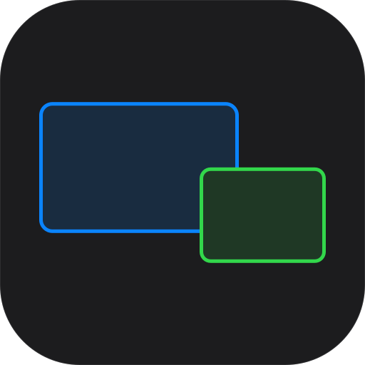

<div align="center">
  
  <h1>OpenSide</h1>
  <p>Arrange your Sidecar iPad from the macOS menu bar.</p>
</div>

macOS remembers where your Sidecar display sits, but moving it means opening System
Settings and dragging a small blue rectangle. OpenSide puts that one job in the menu
bar: pick a position, change the resolution, connect or disconnect — without leaving
what you were doing.


## What it does

- **Position the Sidecar display** with eight presets — corners, edges, and centers —
  or drag it in the miniature layout for finer placement
- **Change resolution and HiDPI** for the Sidecar display without opening System Settings
- **Connect and disconnect Sidecar** from the menu bar
- **Explain why no iPad was found** when discovery comes up empty, and open the relevant
  settings pane directly
- **Remember your last arrangement** and reapply it with one click
- **Speak your language** — English, 한국어, 日本語, 简体中文

It stays out of the way: no Dock icon, no window, no background network activity.

## Requirements

- macOS 14 Sonoma or later
- An iPad that already works with Sidecar

Sidecar itself requires both devices to be signed in to the same Apple Account (Apple ID),
with Bluetooth, Wi-Fi, and Handoff enabled. OpenSide does not change those requirements —
it alerts you when Wi-Fi or Handoff is turned off on your Mac, and links directly to
the relevant settings pane.

OpenSide is developed and tested on macOS 27. It reaches Sidecar through a private
Apple framework whose names are not documented, so behaviour on older versions is not
verified. Reports are welcome.

## Install

Download the latest `.dmg` from [Releases](../../releases), drag the app to
`/Applications`, and launch it. The icon appears in the menu bar.

The release is signed with a Developer ID certificate and notarized by Apple, so it
opens without a Gatekeeper warning.

### Build from source

```sh
git clone https://github.com/bldev2473/openside.git
cd openside
swift build -c release
./scripts/build_app.sh          # produces OpenSide.app
```

`build_app.sh` signs the bundle with a Developer ID or Apple Development certificate if
it finds one, and ad-hoc otherwise. Set `OPENSIDE_SIGN_IDENTITY` to choose. Ad-hoc is
enough to run the app on your own Mac.

To work in Xcode, generate the project first:

```sh
brew install xcodegen
cd Apps/OpenSide && xcodegen generate && open OpenSide.xcodeproj
```

The Xcode project is generated from `project.yml`; edit that file rather than the
`.xcodeproj`, which is not tracked. Signing lives in `Local.xcconfig` — copy
`Local.xcconfig.example` and put your own Team ID in it.

## How it works

OpenSide talks to `SidecarCore`, the same private framework the Sidecar menu in
Control Center uses, to list and connect devices. Display positions and resolutions
go through CoreGraphics.

Because it depends on a private framework, OpenSide cannot ship on the Mac App Store
and is distributed directly.

## Security

See [SECURITY.md](SECURITY.md) for details on app permissions, system scope, and
instructions on how to verify download authenticity.

## AI assistance

Parts of this project were written with AI coding tools. Every change was reviewed,
built, and tested by the maintainer, who takes full responsibility for the code.

## License

MIT. See [LICENSE](LICENSE).

Copyright © 2026 bldev2473
