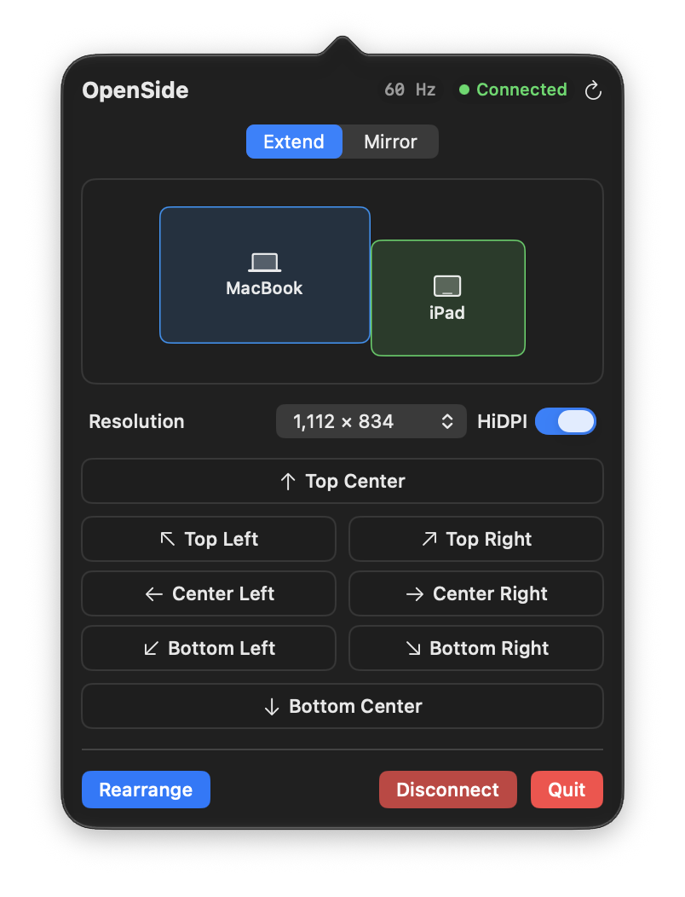

# OpenSide

Arrange your Sidecar iPad from the macOS menu bar.

macOS remembers where your Sidecar display sits, but moving it means opening System
Settings and dragging a small blue rectangle. OpenSide puts that one job in the menu
bar: pick a position, change the resolution, connect or disconnect — without leaving
what you were doing.



## What it does

- **Position the Sidecar display** with eight presets — corners, edges, and centres —
  or drag it in the miniature layout for finer placement
- **Change resolution and HiDPI** for the Sidecar display without opening System Settings
- **Connect and disconnect Sidecar** from the menu bar
- **Say why no iPad was found** when discovery comes up empty, and open the relevant
  settings pane directly
- **Remember your last arrangement** and reapply it with one click
- **Speak your language** — English, 한국어, 日本語, 简体中文

It stays out of the way: no dock icon, no window, no background network activity.

## Requirements

- macOS 14 Sonoma or later
- An iPad that already works with Sidecar

Sidecar itself needs both devices signed into the same Apple ID, with Bluetooth,
Wi-Fi and Handoff on. OpenSide does not change those requirements — it tells you when
one of them is missing.

## Install

Download the latest `.dmg` from [Releases](../../releases), drag the app to
`/Applications`, and launch it. The icon appears in the menu bar.

### Build from source

```sh
git clone https://github.com/bldev2473/openside.git
cd openside
swift build -c release
./scripts/build_app.sh          # produces OpenSide.app
```

To work in Xcode, generate the project first:

```sh
brew install xcodegen
cd Apps/OpenSide && xcodegen generate && open OpenSide.xcodeproj
```

The Xcode project is generated from `project.yml`; edit that file rather than the
`.xcodeproj`, which is not tracked. Signing lives in `Local.xcconfig` — copy
`Local.xcconfig.example` and put your own Team ID in it.

## How it works

OpenSide talks to `SidecarCore`, the same private framework the Sidecar menu in
Control Center uses, to list and connect devices. Display positions and resolutions
go through CoreGraphics.

Because it depends on a private framework, OpenSide cannot ship on the Mac App Store
and is distributed directly.

## License

MIT. See [LICENSE](LICENSE).

Copyright © 2026 bldev2473
